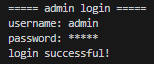

# 📦 Inventory Management System (C++)

A simple **Console-Based Inventory Management System** built using **C++ and OOP concepts**.
This project allows an admin to manage inventory items including adding, updating, deleting, searching, sorting, and displaying items with file storage support.

---

## 🚀 Features

* 🔐 Admin Login System (Username & Password Protected)
* ➕ Add New Item
* 📋 Display Inventory
* 🔍 Search Item (Case-Insensitive)
* ✏️ Update Item Quantity
* ❌ Delete Item
* 📊 Sort Inventory (By Name, Price, Quantity)
* 💾 File Handling (Data stored in `inventory.txt`)
* 🔄 Auto Save on Exit

---

## 🛠 Technologies Used

* C++
* Object-Oriented Programming (OOP)
* STL (Vector, Algorithm)
* File Handling (ifstream, ofstream)
* Windows Console (`conio.h` for password masking)

---

## 🧠 Concepts Implemented

* Classes & Objects
* Structures
* Vectors
* Lambda Functions
* File I/O
* Data Validation
* Case-Insensitive Searching
* Sorting with Custom Comparators

---

## 📂 Project Structure

```
Inventory-Management-System-PF-CPP-Project/
│
├── Source.cpp
├── inventory.txt   (Auto-generated)
└── README.md
```

---

## 📸 Application Screenshots

<p align="center">
  
  
</p>

<p align="center">
  
  
  
</p>

---


## 🔐 Default Admin Credentials

```
Username: admin
Password: 12345
```

---

## 💻 How to Run

### 🪟 Windows (Using CodeBlocks / Dev-C++ / VS Code)

1. Clone the repository:

```
git clone https://github.com/kashifraza01/Inventory-Management-System-PF-CPP-Project.git
```

2. Open `Source.cpp`
3. Compile & Run

OR using terminal:

```
g++ Source.cpp -o Source
Source.exe
```

---

## 📸 Program Menu

```
1. Add Item
2. Display Inventory
3. Search Item
4. Update Quantity
5. Delete Item
6. Sort Inventory
7. Exit
```

---

## 📁 Data Storage

All inventory data is stored in:

```
inventory.txt
```

Each item is stored in the format:

```
Item Name
Quantity
Price
```

---

## 🔎 Sorting Options

* Sort by Name (Alphabetically)
* Sort by Price (Low to High)
* Sort by Quantity (Low to High)

---

## 🎯 Future Improvements

* Role-based login (Admin/User)
* Price update option
* GUI version Java FX
* Database integration (MySQL)
* Sales & Billing Module
* Stock alerts when quantity is low

---

## 👨‍💻 Author

**Kashif Raza**
